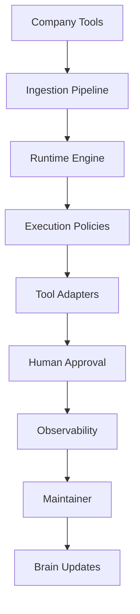

# Company Brain

A tool-agnostic operational intelligence runtime for AI-native companies.

Company Brain turns organizational knowledge into executable workflows with:

- AI agents
- Human approvals
- Workflow orchestration
- Runtime observability
- Self-improving feedback loops

---

## Features

- Capability-based runtime
- Tool-agnostic architecture
- Workflow orchestration
- Durable execution state
- Human-in-the-loop approvals
- Runtime observability
- Self-improving maintainer loop

---

## Quick Start

### Clone repo

```bash
git clone https://github.com/Ifeoba/company-brain.git
cd company-brain
```

### Create virtual environment

```bash
python3 -m venv venv
source venv/bin/activate
```

### Install dependencies

```bash
pip install -r requirements.txt
```

### Run runtime

```bash
python run.py
```

---

## Example Output

```
[Runtime] Loaded brain: sample-support-brain
[Runtime] Loaded capabilities
[Runtime] Listening for events...
[Runtime] Workflow executed successfully
```

---

## Architecture



---

## Roadmap

- [x] Runtime MVP
- [x] Capability abstraction
- [x] Tool mapping layer
- [x] Execution policies
- [ ] Slack integration
- [ ] Web dashboard
- [ ] Cross-brain orchestration
- [ ] Multi-agent runtime

---

## License

MIT
